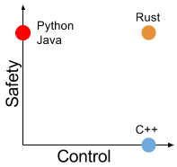

name: inverse
layout: true
class: left, middle
---
class: center, middle
#The Rust Programming Language

---
# What is Rust?
 - **Project sponsored by Mozilla**
    - Started in 2006 by Graydon Hoare
    - Sponsored by Mozilla in 2009
    - Went 1.0 in May 2015
 - **'Systems Programming Language that runs blazingly fast, prevents segfaults and guarantees thread safety.'**
    - Compiled language that uses LLVM
    - On-par performance with C/C++
    - No garbage collector, no runtime overhead
    - Provides memory safety & elimates data races
 - **There are several companies using Rust in production**
    - [Dropbox - Magic Pocket](http://www.wired.com/2016/03/epic-story-dropboxs-exodus-amazon-cloud-empire/)
    - [Chef - Habitat](https://github.com/habitat-sh/habitat)
    - Mozilla - Servo

???
- LLVM is a library that is used to construct, optimize and produce intermediate and/or binary machine code
- Systems programming language doesn't really have a specific definition but I think people generally say that it can
be used in applications to replace C/C++
---
layout:false
.left-column[
  ## Why another programming language?
  
]
.right-column[
- C/C++ provides control at the expense of memory safety (easy to shoot yourself in the foot) 
   - Double free
   - Null/Wild/Dangling pointer
   - Ability to optimize your application to meet performance and memory contraints

- Python provides safety at the expense of control
  - Garbage collector & runtime will prevent memory safety issues listed above
  - Unpredictable pauses during garbage collection which incur a runtime cost
  - Requires a runtime, making it difficult to talk to other languages
  - It is up to the runtime to determine how your program is executed

- Rust provides the best of both worlds with control & safety
]
???
**Intro**
- In order to discuss why we need a new programming language, we need to frame the conversation towards what 
tradeoff a programming language typically makes in regards to control vs safety.

**C/C++**
- Here are some examples of memory safety issues, double free, null, wild and dangling pointer
   - Double free => occurs when free() is called more than once on a value
   - Null pointer => null pointer dereference
   - Wild Pointer => using an uninitialized pointer which can cause memory corruption
   - Dangling pointer => pointer that points to data which is not valid anymore
   (e.g., pointer to allocated object -> object is deleted -> pointer is pointing to invalid data)

**Python**
- If you have a runtime, it is hard to talk to other languages: 
- You don't see Ruby interfaced with Java but you see Ruby interfaced with C

---
# What is control? (C++) 
```c++

void a_function() {
  // Control memory layout, (e.g.,ability to inline data on the stack)
  std::vector<std::string> vec;
  vec.push_back("hello world");

  // Lightweight references, pointers straight into memory
  std::string* num = &vec[0];

  // Deterministic destruction of objects.
  // vec goes out of scope and is destructed
}
```
???
- This is a simple example, but it demonstrates a remarkable amount of low level control
1. Fields of the vector are directly put onto the stack
2. Pointer to the first element of the vector. No copying involved, lightweight reference and no additional layers of indirection involed
3. The vector goes out scope, it is destroyed and its data is freed.  When you look at this code and you know exactly when vector is being freed. There aren't unpredictable pauses for things like garbage collection
- Dropbox's encountered issues with parts of their system where Go's memory footprint was too large.
They needed a language with low-level control of memory allocation which enables them
to optimize how little memory they needed to manage 1GB (or 1PB) of data. 
---
# What is safety? (C++)
```c++
void a_function() {
  // Vector with one element, with some capcity
  std::vector<string> vec;
  .....

  // ALIASING: Two pointers to a single piece of data
  //  - str_ptr is a pointer to the first element in the vector
  //  - vec internally has a pointer to the first element in the vector
  string* str_ptr = &vec[0];

  // MUTATION: an alias is mutating a piece of data
  //  - vec went over capacity, reallocation occurs
  //  - str_ptr points to an invalid memory address
  vec.push_back(some_string);

  // ERROR: Dangling Pointer!!
  string str = *str_ptr
}
```
???
We can take a simple example of you can shoot yourself in the foot with C++

**How does a vector work**
- When you create a vector, internally it will allocate some block of memory where you can push in some number of elements
- Once that block of memory is filled, it allocated a whole new block and copy the old elements to the new block and deallocate the old block of memory

**Back to the example**
- If the reallocation happens when we push a new string to the vector, str_ptr is not pointing to an invalid piece of data making it a dangling pointer
- The vector patched up it's own internal pointers but isn't aware of any other pointers using that piece of data

**Aliasing and Mutation**
- We have two aliases, str_ptr and vec's internal pointer to the data
- By pushing a new element into the vector, a reallocation occurs and we cause a mutation of the data

**Implications**
- Best case this causes a segmentation fault but worst case it can be a security exploit
   - This seems like very reasonable for someone who might come from java programming
- Typically solving this issue has been done using a GC to help ensure that objects are created when needed and deleted when all references are gone
- Mozilla says that a lot of their security vulnerabilities in Gecko (browser engine) is due to memory unsafety
---
class: left, middle
### **Problem** : Aliasing + Mutation at the same time cause memory unsafety
- Aliasing makes dependencies non-obvious (vector's internal pointers & our string pointer)
- Mutation can cause the memory to freed

### **Solution**
Rust compiler ensures that both aliasing and mutation **cannot** happen at the same time. It achieves it through **Ownership & Borrowing** and with it we get the following:
* No need for a runtime
* Memory safety
* Data-race freedom

**This solution is done at compile-time**

???
I want to reiterate that rust checks for memory safety at **compile-time**, no static analysis tool.
If there is a memory safety issue with your program, it will be captured at compile-time
---
# Other language features
* Pattern matching
* Traits
* Metaprogramming 
* Package Manager

???
Before we get into ownership and borrowing, Rust is a modern programming language and provides all these features.

---
# Ownership (~~Aliasing~~ + Mutation)
##### Data can only have one owner a a time 

```rust
fn main() {
    // The variable binding 'my_vec' OWNS the vector
    let mut my_vec  = Vec::new();

    my_vec.push(1);
   // my_vec goes out of scope and will be freed/released
}
```

##### We can move the data's ownership to another variable binding 
```rust
fn main() {
  // 'orig_owner' OWNS the vector
  let mut orig_owner  = vec![1,2,3];

  // Move ownership from 'orig_owner' to 'new_owner'
  let mut new_owner = orig_owner;

  // Compiler will complain!!!
  orig_owner.push(4);
}
```
???
- I am a owner of a notebook.  I am the only one using reading or writing in it.
- I transfer the ownership of the book to my friend. I can disappear/go away
- My friend is now the owner, and he/she is the only one who can use the book.  
- If my friend goes away/disappears, the book no longer has an owner, it can be freed.
---
# Ownership (~~Aliasing~~ + Mutation)
* Moves are automatic, unlike C++'s std::move
* Conceptually, moves are shallow copies but the compiler may optimize it out

```rust
fn some_func(mut vec: Vec<i32>) {
  vec.push(4);
}

fn main() {
  let mut v = vec![1,2,3];
  
  // 'v' is moved to 'some_func(mut vec: Vec<i32>)' 
  some_func(v);

  // Compiler complains!!
  v.push(5);
}
```
---
#Ownership (~~Aliasing~~ + Mutation)
* For  main() to have ownership of the vector, we would be need to move it back.

```rust
fn some_func(mut vec: Vec<i32>) ->  Vec<i32>{
  vec.push(4);
  vec
}

fn main() {
  let mut v = vec![1,2,3];
  
  // 'v' is moved to 'some_func(mut vec: Vec<i32>)' 
  let mut v_2 = some_func(v);

  v_2.push(5);
}
```
**Very annoying** if we have to continually moving data around, into functions and returned from function.
Luckily, Rust provides a mechanism to lend out data

---
# Borrowing
There are two types of borrows in Rust
* Shared Borrow
```rust
fn some_function(vec: &Vec<i32>) {}
```
* Mutable Borrow
```rust
fn some_function(vec: &mut Vec<i32>) {}
```
???
# Compiler enforces several things
1. When the borrow/reference goes out of scope, the borrow ends
2. When we borrow an object, we are simply taking a reference to a piece of data. Borrow can't last for a scope greater than the actual piece of data
3. You may have one or the other of these two kinds of borrows, but not both at the same time

# Shared borrow bookexample
1. Lend out one or more references to the book to many friends a at a given time
2. The reference to the book is read only, the lendee cannot write in it.

# Mutable Borrow book example
1. I lend out a single refernece to the book at a given time
2. The lendee is able to write and read the book
---
# Shared Borrow (Aliasing + ~~Mutation~~)
* Rule: one or more immutable references (&T) to a resource

```rust
fn borrow(vec: &Vec<i32>) {
  println!("{:?}", vec);
}

fn main() {
  let mut vec = vec![1,2,3,4];
  borrow(&vec); // Borrow!
  println!("{:?}", vec);// Works!
}
```
---
# Mutable Borrow (~~Aliasing~~ + Mutation)
* Rule: exactly one mutable reference (&mut T), it is the **only** way to access the memory it points at.

```rust
fn mutable_borrow(vec: &mut Vec<i32>) {vec.push(5);}

fn main() {
  let mut vec = vec![1,2,3,4];
  mutable_borrow(&mut vec); // Mutable Borrow!
  println!("{:?}", vec);// Works!
}
```
---
# Preventing dangling pointers
```rust
fn push_all(source: &Vec<i32>, dest: &mut Vec<i32>) {
  for elem in source {
    dest.push(*elem);
  }
}

fn main() {
  let mut vec = vec![1,2,3,4];
  push_all(&vec, &mut vec);
}
```

We get the following error
```
<anon>:11:23: 11:26 error: cannot borrow `vec` as mutable because 
it is also borrowed as immutable [E0502]
<anon>:11   push_all(&vec, &mut vec);
```

???
* Let's loop back to the issue of dangling pointer that we previously in the C++ example.
* If we take a look at the push_all function,it simply take elements from one vector and pushes it 
to the other vector.  
* What would happen if we tried to have a single vector be both parameters into the push_all vector? This is an iterator invalidation and possible dangling pointer issue
* If it were to allow this situation, as you keep pushing to the vector a reallocation might occur
and you get a dangling pointer

The compiler will complain saying we can't borrow vec as mutable since it is already borrowed as immutable. 
---
# Borrowing Example
How does the rust compiler determine when a borrow has been completed?
```rust
fn main(){
  let mut vec = vec![1,2,3,4,5];
  for i in 0..vec.len() {
    let elem: &int = &vec[i];//<----+ Start Shared Borrow
                                    |
    ...                             |
                                    |
    // ERROR: vec[i] is borrowed    |                    
    vec.push(6)//                   |                    
  }// <-----------------------------+ End Shared Borrow  
  // OK: Shared Borrow Ended                             
  vec.push(5);
} 
```
???
- Let's take a look at how the rust compiler protects us with more complicated borrowing example
- How does the rust compiler determine when a borrow has been completed?
- That is done with lifetimes, which is just another word for lexical scope.
---
# What is Rust's concurrency story?
* Rust is not prescriptive in what type of paradigm you want to use for your concurrent application.
* This is unlike languages like Go where messaging passing is the preferred way to write concurrent application

Rust supports many different paradigms for concurrent application
* Message Passing
* Shared state concurrency

How does ownership and borrowing help solve issues with multithreaded programs?
???
- C++ the compiler were not really trying to help me to write correct programs when it comes to concurrency 
---
# Data Races

### What is a data race?
Two unsynchronized threads access that access the same data where **at least one thread writes**.

### Observation
**Aliasing** + **Mutation** + Unordered => Data Race

### Solution
- Rust already solves the Aliasing and Mutation problem through ownership and borrowing.  
- At compile-time Rust can guarantee that our code will be **data-race free**.
- The Rust compiler makes sure that all data sharing is **explicit**, so that the developer cannot accidently share data between threads.

???
- One thing you might notice is that you may notice is that
   * Aliasing - two threads point to a single piece of data
   * Mutation - one thread writes
   * Unordered - non synchronized threads
- If we take a step back, we realize that Rust already solves the aliasing + mutation issue.
- We can check for data races **AT COMPILE TIME**
---
## Message Passing 
* Instead, we are moving ownership of the data from the one thread to another thread. 
Before we were moving ownership of data from one variable binding to another.

```rust
use std::sync::mpsc::channel;
use std::thread::spawn;
fn main() {
  // Create channel with transmit and receive end
  let (tx, rx) = channel();
  let mut my_vec = vec![1,2,3];

  // Move ownership of tx and my_vec into the child thread 
  spawn(move || {
    my_vec.push(4);
    tx.send(my_vec).unwrap();
  });

  // This is ILLEGAL
  // my_vec.push(5);
  println!("{:?}", rx.recv().unwrap());
 }
```

???
* The great thing here is that we get this check at compile time
---
## Locked Mutable access (shared state)
**C++**
```cpp
pthread_mutex_t mutex;
void init_mutex() {
  pthread_mutex_init(&mutex, NULL);
}

void add(int &data) {
  pthread_mutex_lock (&mutex);
  data += 1;                    //<----- Critical Section
  pthread_mutex_unlock (&mutex);
}
```

**Rust**
```rust
fn create_mutex() -> Mutex<i32> {
  Mutex::new(0)
}

fn add(mutex: &Mutex<i32>) {        //<--+ Mutex borrow starts here
  let &mut data = mutex.lock();     //   |
  *data += 1;                       //   |
} //<------------------------------------+ Mutex borrow ends here,
  //                                       releases the lock automatically
```
???
* If we take a look at the C++ example, we will notice that the mutex is a data struture separate from the data it is protecting (pthread_mutex_t)
And we have to explicitly surround the critical section (part of the program that requires mutual exclusion of access) with _lock and _unlock
* This is different from how Rust's mutexes are defined differently, in that the ownership of the data (integer in this case) has been moved into the mutex.  The lock OWNS the data it is protecting.
   * When you call the lock function on the mutex, you get the mutable reference to the data back. 
   * This enforces the fact that the only way to mutate the data, is to lock the mutex as opposed to the C++ example
   * The #1 benefit here is that the compiler enforces correct lock based programming, no way to accidently mutate the data between threads when you didn't mean to.
---
# Questions?
???
Unsafe rust is definetely a thing.
---
# Sources
* http://www.slideshare.net/nikomatsakis/guaranteeing-memory-safety-in-rust-39042975
* https://people.mozilla.org/~acrichton/rust-talk-2014-12-10/#/5
* http://www.infoq.com/presentations/rust-thread-safety
* http://pro.theta.eu.org/
* https://cis198-2016s.github.io/schedule/